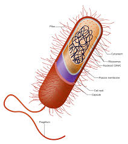

# Biomolecules
## Cell Theory
>Theory that states that all organisms are made of cells, all cells are produced by other living cells, and the cell is the most basic unit of life.

The theory that states all living things have cells, all cells come from other cells, and that cells are the most basic form of life.

**Does cell theory contain everything known about cells?**

Cell theory contains everything known about cells.

Cell theory doesn't contain everything known about cells, in fact all of it is incorrect.

Cell theory doesn't contain everything known about cells, but is mostly true from what we know.

Cell theory is a myth.

##Prokaryote
>A cell that does not have a nucleus or other membrane-bound organelles.

A cell without a nucleus.

**Can a prokaryotic organism be multicellular?**

Yes

No

## Eukaryote
>A cell that has a nucleus and other membrane-bound organelles.

A cell with a nucleus.

**Is a eukaryotic cell able to reproduce asexually?**

No, they must reproduce sexually.

They can, by splitting the nucleus in two and splitting itself in half.

They can, by forming another one of itself out of thin air.

They can't, because they have a nucleus.

## Macromolecule
>A large complex molecule, such as nucleic acids, proteins, carbohydrates, and lipids, with relatively large molecular weight.

A large molecule.

**Which one is NOT a macromolecule?**

A saccharide

Lipids

Water

DNA

## Carbohydrate
>Any of the group of organic compounds consisting of carbon, hydrogen, and oxygen.

A fuel-containing macromolecule, contains saccharides and lipids.

**Which food does NOT contain carbohydrates?**

Potato

Bread

Apple

Beef

## Lipid
>A fatty or waxy organic compound, and whose major biological functions involve energy storage.

A carbohydrate that stores energy.

**Are lipids the same as carbohydrates? True or false.**

True

False

## Protein
>A molecule composed of polymers of amino acids.

A macromolecule specialised in building other macromolecules.

**Which one is NOT a protein?**

Blood

DNA

Enzyme

Nucleic Acid

## Nucleic Acid
>Any of the group of complex compounds consisting of linear chains of monomeric nucleotides.

An organic molecule containing information/instructions to create cells.

**Which is true of nucleic acids?**

They build other molecules.

They store information.

They store energy.

They create energy.

## Monomer
>The simplest unit, or the repeating unit, of a polymer.

A single molecule in a polymer of multiple of that molecule.

**Which one is a monomer?**

A molecule in a chain of other molecules.

A macromolecule.

A nucleic acid.

A carbohydrate.

## Polymer
> A compound made up of several monomers.

Several monomers in a string.

**Are polymers a macromolecule? True or false.**

True

False

## Saccharide
>The unit structure of carbohydrates.

Sugar

**Which one does NOT contain sugar?**

Meat

Lettuce

Soda

Peanut

## Hydrolysis
>A chemical reaction in which the interaction of a compound with water results in the decomposition of that compound.

The decomposition of a substance in water.

**What is hydrolysis?**

The destruction of a substance in water.

The decomposition of a substance in water.

The creation of a substance in water.

The building of a substance in water.

## Dehydration Synthesis
>A chemical reaction whereby a water molecule is lost, such as that during the synthesis of an organic compound.

When a substance losed a water molecule during synthesis.

**What is dehydration synthesis?**

The loss of a water molecule during synthesis.

The loss of a carbon atom during synthesis.

The gain of a water molecule during synthesis.

The gain of a carbon atom during synthesis.

## Organic Molecule
>A molecule that is normally found in or produced by living systems.

A molecule containg carbon and other organic elements.

**Which one is NOT an organic molecule?**

Nucleic acid

Carbohydrate

Lipid

Plastic
