# Cell Transport
## Diffusion
>The movement of molecules or particles along a concentration gradient.

The movement of particles to lower concentration.

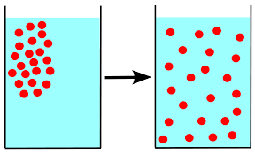

**What is diffusion?**

The movement of particles across a channel protein.

 
The movement of particles from high concentration to low concentration.

The movement of particles across a cell membrane.

The movement of particles against a concentration gradient.

## Cell Transport

>Cell transport is the movement of materials across cell membranes.

The movement of a particle through a cell membrane.

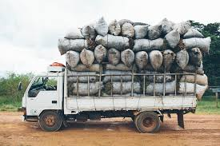

**What is cell transport?**

The difference in concentration from one area to another.

 
The movement of particles through a protein channel.

The movement of particles against a concentration gradient.

The movement of particles through a cell membrane.

## Cell Membrane

>The cell’s outer membrane made up of a two layers of phospholipids with embedded proteins.

The cell's border.

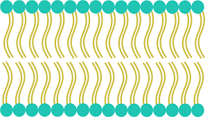

**What is the cell membrane *mostly* made out of?**

Water.

 
Protein channels.

Phospholipids.

Nothing, a cell is just a puddle of cytoplasm with stuff inside it.

## Semi-Permeable

>A membrane that is selectively permeable.

A membrane where only certain stuff can get through, mainly water.

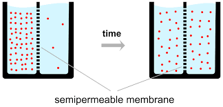

**What does it mean when something is semi-permeable?**

It means it only lets through certain things.

 
It means that it lets everything through it.

It means it lets nothing through it.

It means it lets through particles using energy.

## Passive Transport

>A kind of transport by which ions or molecules move along a concentration gradient.

The transportation of a particle in which no energy is used.

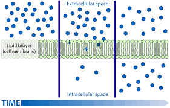

**Is facilitated diffusion a type of passive transport?**

Yes, but only if it goes with the concentration gradient.

 
Yes, but only if it goes against the concentration gradient.

No, because facilitated diffusion uses energy to get particles through.

No, because facilitated diffusion doesn't use energy.

## Osmosis

>Diffusion of a solvent (usually water molecules) through a semi-permeable membrane from an area of low solute concentration to an area of high solute concentration.

The movement of water in high concentration to low concentration through a semi-permeable membrane.

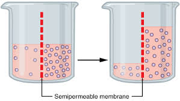

**How does osmosis work?**

By transporting water across a protein channel.

 
By magically teleporting water across a semi-permeable membrane.

By moving water from a low concentration of water to a higher concentration through a semi-permeable membrane.

By moving particles against a concentration gradient.

## Facilitated Diffusion

>Transport of substances across a biological membrane from an area of higher concentration to an area of lower concentration by means of a carrier molecule.

When a particle needs help to get through a cell membrane.

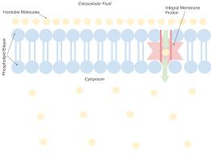

**Does facilitated diffusion use up energy?**

Yes, because it moves particles against a concentration gradient.

 
Yes, because it moves particles with a concentration gradient.

No, because it moves particles with a concentration gradient.

Depends, facilitated diffusion moves particles with a concentration gradient or against a concentration gradient.

## Active Transport 

>A kind of transport wherein ions or molecules move against a concentration gradient.

Transportation of a particle, where energy is used.

**Why does active transport require energy?**

It needs energy to move particles through a cell membrane.

 
It needs energy to move particles against a concentration gradient.

It needs energy to move particles with a concentration gradient.

It doesn't need energy at all.

## Endocytosis

>A process in which cell takes in materials from the outside by engulfing and fusing them with its plasma membrane.

When a large molecule is engulfed by a cell, where the membrane goes with it.

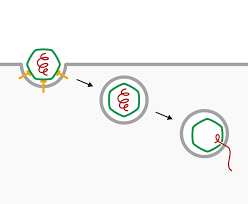

**How does endocytosis work?**

By teleporting large particles through a cell membrane.

 
By moving large particles through a protein channel.

By moving small particles through a semi-permeable membrane.

By moving large particles inside a cell by fusing part of its cell membrane to it, and then detatching that part of the cell membrane.

## Exocytosis

>The process of vesicles fusing with the plasma membrane and releasing their contents to the outside of the cell.

The opposite of endocytosis.

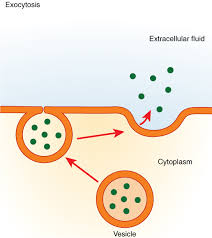

**What is exocytosis?**

The movement of large particles out of a cell by fusing to the cell membrane.

 
The movement of particles through a protein channel.

The movement of large molecules against a concentration gradient.

The movement of particles through a semi-permeable membrane.

## Phospholipids

>A lipid with one or more phosphate groups attached to it.

The building block of a cell membrane.

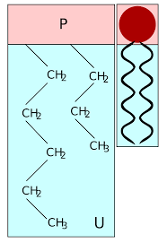

**What do phospholipids make up?**

They make up a concentration gradient.

 
They make up a channel protein.

They make up a cell membrane.

They don't make up anything.

## Channel Proteins

> A channel protein is a special arrangement of amino acids which embeds in the cell membrane, providing a hydrophilic passageway for water and small, polar ions.

A channel where big molecules are allowed passage, or molecules that otherwise wouldn't be able to get through a cell membrane(excluding really large molecules).

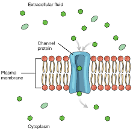

**What does a channel protein do?**

It transports water across a semi-permeable membrane.

 
It transports big molecules across a cell membrane.

It carries out the process of endocytosis.

It does nothing.

## Concentration Gradient

>A gradual change in the concentration of solutes in a solution as a function of distance through a solution.

The difference between one concentration and another.

**What is a concentration gradient?**

The movement of particles through a protein channel.

 
The movement of water through a semi-permeable membrane.

The difference in concetration from one area to another.

The use of energy to transport particles through a cell membrane.

## ATP

>ATP is a nucleotide that contains a large amount of chemical energy stored in its high-energy phosphate bonds.

A fuel used for cell respiration.

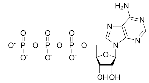

**What is ATP used for?**

To use as an energy source.

 
To move big molecules across a cell membrane.

To move particles against a concentration gradient.

Tomove particles with a concentration gradient.

## Fluidity

>The reciprocal of viscosity.

How unresistant a liquid is to moving.

**What is fluidity?**

It is the movement of particles across a cell membrane.

 
It is the movement of particles across a protein channel.

It is how easily a liquid is able to move.

It is the resistance of a liquid to move.

## Concentration

>The measure of the amount of a sub-component (especially solute) in a solution.

How densely packed something is.

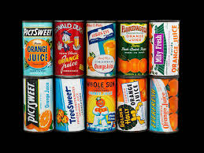

**What is concentration?**

It is made up of phospholipids.

 
It is how tightly packed an area is.

It is what moves particles with a concentration gradient.

It is the movement of particles through a protein channel.
