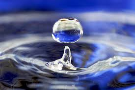

# Cell Transport
## Diffusion
>The passive movement of molecules or particles along a concentration gradient.

The movement of particles to lower concentration.

**Question?**

 

## Cell Transport

>

**Question?**

 

## Cell Membrane

>

**Question?**

 

## Semi-Permeable

>

**Question?**

 

## Passive Transport

>

**Question?**

 

## Osmosis

>

**Question?**

 

## Facilitated Diffusion

>

**Question?**

 

## Active Transport 

>

**Question?**

 

## Endocytosis

>

**Question?**

 

## Exocytosis

>

**Question?**

 

## Phospholipids

>

**Question?**

 

## Channel Proteins

>

**Question?**

 

## Concentration Gradient

>

**Question?**

 

## ATP

>

**Question?**

 

## Fluidity

>

**Question?**

 

## Concentration

>

**Question?**

 

