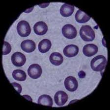

# Characteristics of life
###### All definitions come from https://biologydictionary.net
### Cell
>Cells are the basic unit of life. In the modern world, they are the smallest known world that performs all of life’s functions. All living organisms are either single cells, or are multicellular organisms composed of many cells working together.

Cells are what every living thing on Earth is made of, and are made up of smaller parts that aren't alive, however a cell is alive.

**Is a cell considered an organism?**

No, but they make up organisms.

 
Yes, but they aren't fully alive.

It depends, there are single celled organisms and there are multi celled organisms.
