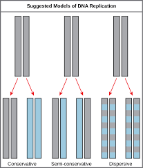

# DNA Replication
## Deoxyribonucleic Acid
>A double-stranded nucleic acid that contains the genetic information for cell growth, division, and function.

DNA is a nucleic acid that is contained inside the nucleus and controls everything in the cell.

**What type of structure is DNA?**

A semi-conservative structure.

A single helix structure.

A double helix structure.

A noodle structure.

## Double Helix
>A conformation or shape describing a structure that typically consists of two matching helices intertwined about a common axis, such as the structure of the DNA molecule, which is made of two linear strands held together in opposite direction through chemical bonds, and which has become twisted into a helix.

A twisted structure made of two helices similar in shape to a twisted ladder.

**Where can a double helix shape be found in the cell?**

DNA

RNA

Mitochondria

Nucleus

## Nucleotide
>The basic building block of nucleic acid polymers.

The monomer that makes up DNA and RNA.

**Which polymer is made up of nucleotide monomers?**

DNA

RNA

Codons

Both A and B

## Codon
>A set of three adjacent nucleotides, also called triplet, in mRNA that base-pair with the corresponding aniticodon of tRNA molecule that carries a particular amino acid, hence, specifying the type and sequence of amino acids for protein synthesis.

A combination of three nucleotides in a row on an mRNA that code for a specific amino acid.

**Where are codons found?**

DNA

mRNA

tRNA

rRNA.

## Gene
>The fundamental, physical, and functional unit of heredity

A series of nucleotides on DNA

**Where are genes located?**

In DNA

Inside codons

In RNA

In the ribosome

## Chromosome
>A structure within the cell that bears the genetic material as a threadlike linear strand of DNA bonded to various proteins in the nucleus of eukaryotic cells.

A long, continuous string of DNA that can be compacted and tightly packed for mitosis.

**What is a chromosome made of?**

RNA

Cells

DNA

Okazaki fragments

## Genome
>The complete set of genetic material in an organism.

Every single piece of genetic information in an organism.

**What is a genome?**

Three nucleotides in a row.

A small sequence of codons.

A bundle of tightly packed DNA.

The full collection of genetic information in an organism.

## Replication
>The process of duplicating or producing an exact copy of a polynucleotide strand such as DNA.

Creating an exact copy of an original material, such as DNA.

**What occurs during DNA replication?**

The splitting of the nucleus

The complete replication of the genome using the semi-conservative model

The forming of new DNA from amino acids

The formation of new DNA from nothing

## Helicase
>An enzyme that utilizes energy from nucleoside triphosphate hydrolysis in order to unwind the two annealed nucleic acid strands.

The enzyme responsible for "unzipping" DNA during DNA replication.

**What does the helicase do?**

Unzip the DNA during DNA replication

Unzip the RNA during mitosis

Help the DNA polymerase by telling it where to go

Unzip the amino acids

## Primase
>The enzyme that polymerises nucleotide triphosphates to form oligoribonucleotides in a 5' to 3' direction.

The guiding enzyme for DNA polymerase.

**What does a primase do?**

Build new DNA strands

Unzip the DNA

Guide the DNA polymerase

Place down okazaki fragments

## DNA Polymerase
>An enzyme assisting in DNA replication.

The enzyme that builds new DNA during DNA replication.

**What does the DNA polymerase do?**

Place nucleotides to build new DNA

Places okazaki fragments

Unzips the DNA

Destroys the DNA

## Ligase
>An enzyme that catalyzes the binding of two molecules.

The enzyme responsible for fixing okazaki fragments.

**What does the ligase do?**

Guide the DNA polymerase

Build new DNA

Place okazqaki fragments on the leading strand

Place okazaki fragments on the lagging strand

## RNA Primer
>A short nucleic acid sequence that provides a starting point for DNA synthesis.

The starting point that a DNA polymerase follows

**What does an RNA primer do?**

Unzips the DNA

Creat okazaki fragments

Glue together the lagging strand

Tells the DNA polymerase where to start

## Leading Strand
>The dna strand that is synthesised continuously during replication.

The strand of DNA that goes in the 5' to 3' direction.

**What direction does the leading strand go?**

The leading strand has no direction

The 5' to 3' direction

The 3' to 5' direction

The 5' to 4' direction

## Lagging Strand
>The dna strand that is replicated discontinuously from the 5' to the 3' direction.

The strand of DNA that goes in the 3' to 5' direction.

**What direction does the lagging strand go in?**

The lagging strand has no direction

The 3' to 5' direction

The 5' to 3' direction

The 1' to 9' direction

## Okazaki Fragment
>Relatively short fragment of DNA synthesized on the lagging strand during DNA replication.

A small fragment of DNA created on the lagging strand during DNA replication.

**Which strand are okazaki fragments found on?**

The lagging strand

The leading strand

The right strand

Okazaki fragments are not found on any strand

## Semi-Conservative Model
>Relating to or being genetic replication in which a double-stranded molecule of nucleic acid separates into two single strands each of which serves as a template for the formation of a complementary strand that together with the template forms a complete molecule.

The model that DNA replication follows

**What model does DNA replication follow?**

DNA replication follows no model

The conservative model

The dispersive model

The semi-conservative model
