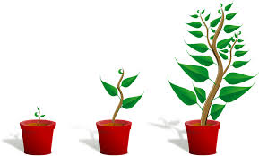

# Bio-Vocab
Biology vocabulary, including a textbook definition, my own definition, some graphics, and a Quiz question relating to the vocab word.

# Characteristics of life
## Cell
>Basic unit of life.

Cells are what every living thing on Earth is made of, and are made up of smaller parts that aren't alive, however a cell is alive.

**Is a cell considered an organism?**

No, but they make up organisms.

 
Yes, but they aren't fully alive.

It depends, there are single celled organisms and there are multi celled organisms.

## Organism
>Any individual living thing.

Organisms are what cells make up, and are living beings

**What do organisms do? Check all that apply.**

They reproduce

They maintain homeostasis.

They can live without any energy.

They create new organisms from nothing with asexual reporduction.

They grow and develop.

## Response to Environment
>"stimulus": Something that causes a physiological response. (so, response to environment/stimulus would be "having a physiological response to a stimulus")

When an organism changes its behaviour because of a stimulus.

**Which one is a response to a stimulus?**

Hair breezing in the wind.

An organism digesting food.

A dog barking when the doorbell rings.

A person sitting down.

## Growth
>(since the textbook doesn't have a definition for this, here's the dictionary definition) The act or process, or a manner of growing.

An organism increasing in size.

**Is growth the same thing as development?**

Yes

No

## Development
>(since development is also not listed in the textbook, here's a dictionary definition) The act or process of developing.

An organism permanently changing the way it works and processes information.

**Which one is _NOT_ a development?**

A catipiller turning into a butterfly.

A baby in its mother's womb.

A maggot turning into a fly.

A tree growing ever so slowly.

## Metabolism
>All chemical processes that synthesize or break down materials within an organism.

The process of obtaining energy from food/fuel.

**Is metabolism connected through homeostasis?**

Yes, you must create enough energy to sustain homeostasis.

No, homeostasis is not connected to metabolism.

## Reproduction
>(once again, the textbook doesn't have a definition, so here's another dictionary definition) The natural process among organisms by which new individuals are generated and the species perpetuated(biology definition).

The creation of new organisms through cell division or transfer of sperm to eggs.

**Which one is an example of reproduction?**

Eating food and having it turn into waste.

A cell dividing into two cells.

Planting a tree and watching it grow.

Adopting a child.

## Homeostasis
>Regulation and maintenance of constant internal conditions in an organism.

Maintaining suitable conditions inside an organism for it to live properly.

**Which one is _NOT_ related to homeostasis?**

Eating 20 burgers a day.

Having a healthy diet.

Exercising.

Sweating.
